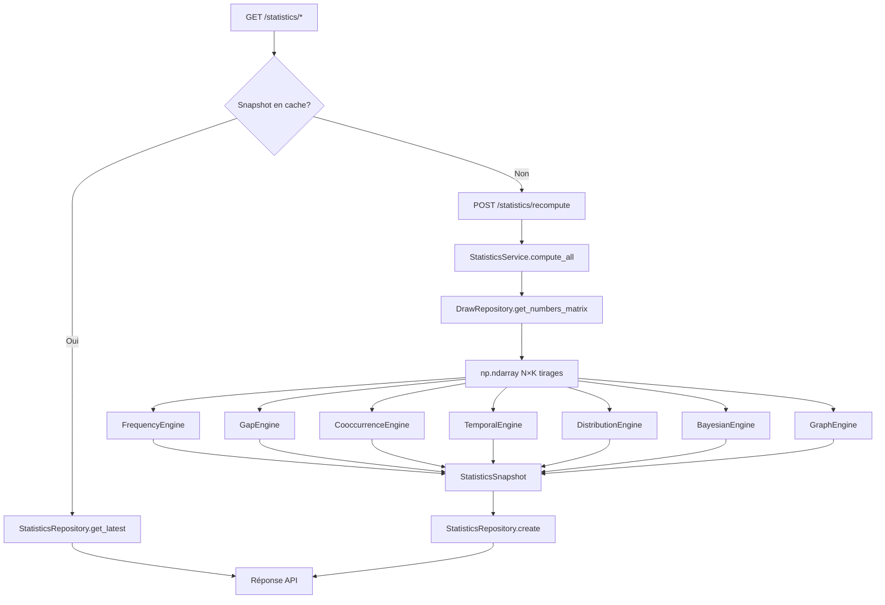
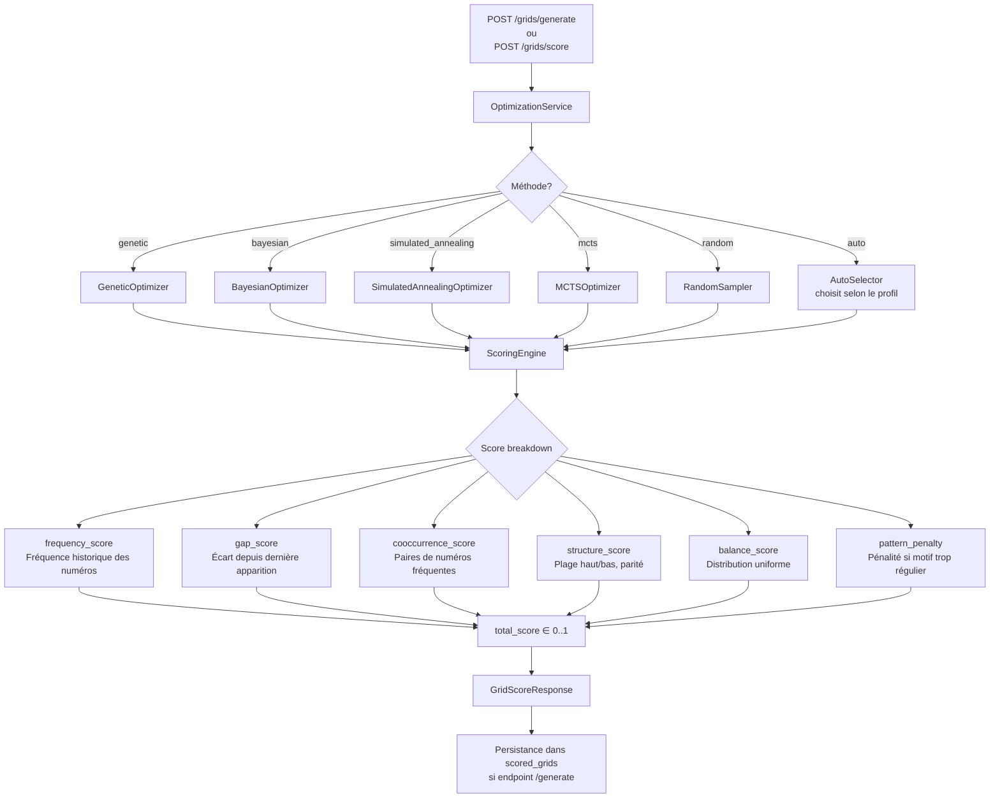
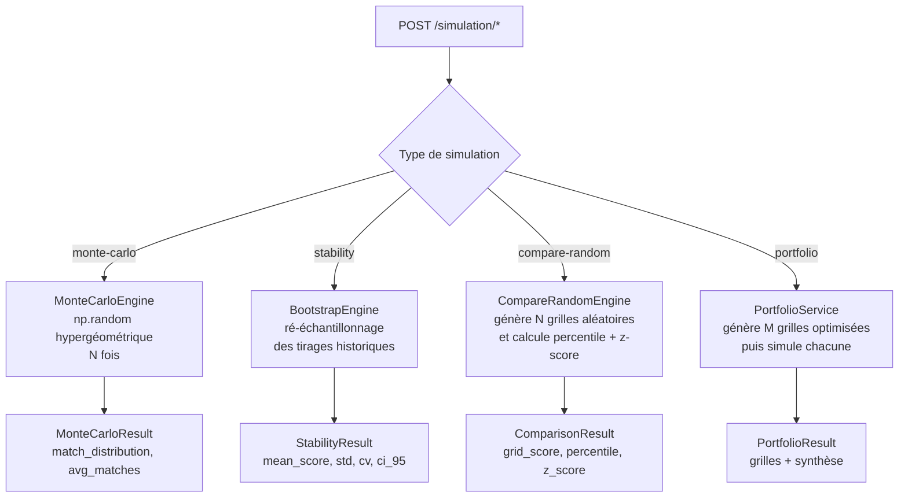

# Architecture des moteurs algorithmiques

## Vue d'ensemble

Loto Ultime utilise une architecture en couches : une API FastAPI orchestre des moteurs algorithmiques spécialisés qui opèrent sur des matrices NumPy de tirages.

---

## Diagramme de flux — Pipeline statistique



---

## Diagramme de flux — Pipeline de scoring



---

## Diagramme de flux — Pipeline de simulation



---

## Couches de l'application

```
┌─────────────────────────────────────────────────────────┐
│                    API Layer (FastAPI)                    │
│  /api/v1/games/{id}/statistics  grids  simulation  ...   │
├─────────────────────────────────────────────────────────┤
│                  Service Layer                           │
│  StatisticsService  ScoringService  SimulationService    │
│  GridService  AuthService  PortfolioService              │
├─────────────────────────────────────────────────────────┤
│                 Engine Layer (NumPy/SciPy)               │
│  FrequencyEngine  GapEngine  CooccurrenceEngine          │
│  TemporalEngine  DistributionEngine  BayesianEngine      │
│  GraphEngine  ScoringEngine  Optimizers (genetic, ...)   │
├─────────────────────────────────────────────────────────┤
│              Repository Layer (SQLAlchemy)               │
│  DrawRepository  GridRepository  StatisticsRepository    │
│  GameRepository  UserRepository                          │
├─────────────────────────────────────────────────────────┤
│                 Data Layer (SQLite + Alembic)            │
│  draws  scored_grids  statistics_snapshots  users  games │
└─────────────────────────────────────────────────────────┘
```

---

## Moteurs statistiques — Détail

| Moteur | Entrée | Sortie | Algorithme |
|--------|--------|--------|------------|
| `FrequencyEngine` | matrice N×K | `{num: {count, relative}}` | comptage + normalisation |
| `GapEngine` | matrice N×K | `{num: {current_gap, avg_gap, max_gap}}` | scan inverse |
| `CooccurrenceEngine` | matrice N×K | matrice Co-occurrence K×K | co-occurrence binaire |
| `TemporalEngine` | matrice N×K | tendances sur fenêtres 10/30/100 | fréquences glissantes |
| `DistributionEngine` | matrice N×K | entropie, score d'uniformité | chi², entropie de Shannon |
| `BayesianEngine` | matrice N×K | priors Beta-Binomial par numéro | mise à jour bayésienne |
| `GraphEngine` | matrice N×K | centralité, communautés | NetworkX + Louvain |

---

## Optimiseurs — Comparaison

| Méthode | Complexité | Points forts | Cas d'usage |
|---------|------------|--------------|-------------|
| `genetic` | O(N·G·P) | Explore l'espace global | Grilles très optimisées |
| `bayesian` | O(N·iter) | Utilise les priors statistiques | Favorise les numéros historiques |
| `simulated_annealing` | O(N·T) | Échappe aux optima locaux | Équilibre exploration/exploitation |
| `mcts` | O(N·sqrt) | Arbre de décision stochastique | Grandes plages de numéros |
| `random` | O(1) | Rapide, baseline | Référence de comparaison |
| `auto` | dépend du profil | Sélection automatique | Usage général |

---

## Flux de données — Frontend ↔ Backend

```
React/TanStack Query
       │
       ▼
  axios (api.ts)         ← JWT Bearer token
       │
       ▼
FastAPI /api/v1/...
       │
       ├── Depend: get_current_user (JWT decode)
       ├── Depend: get_game_config  (DB → YAML)
       │
       ▼
Service Layer
       │
       ▼
Repository + Engine
       │
       ▼
SQLite (loto_ultime.db)
```
